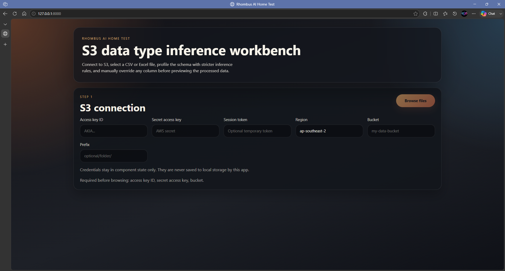
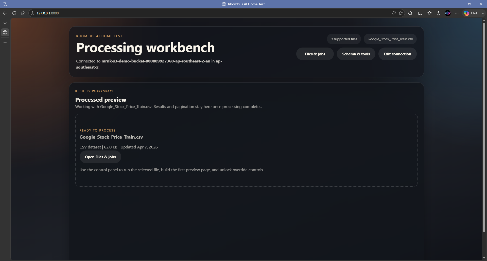
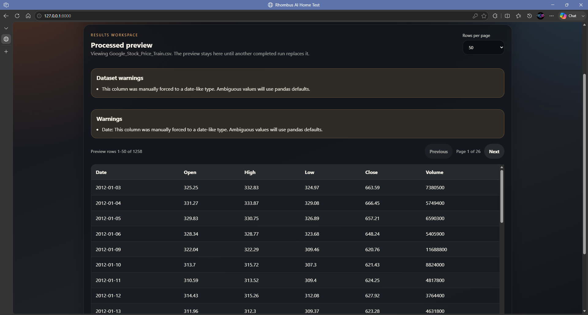
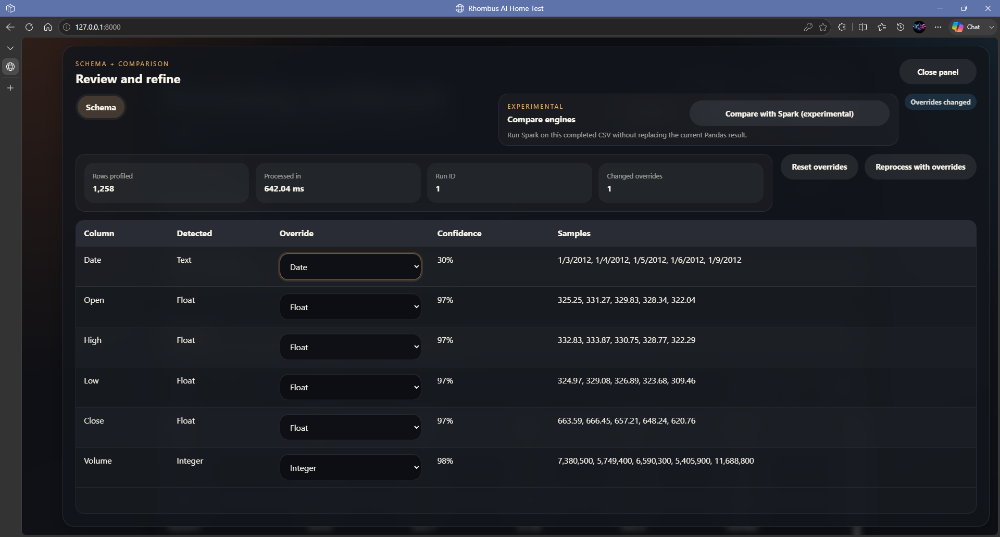
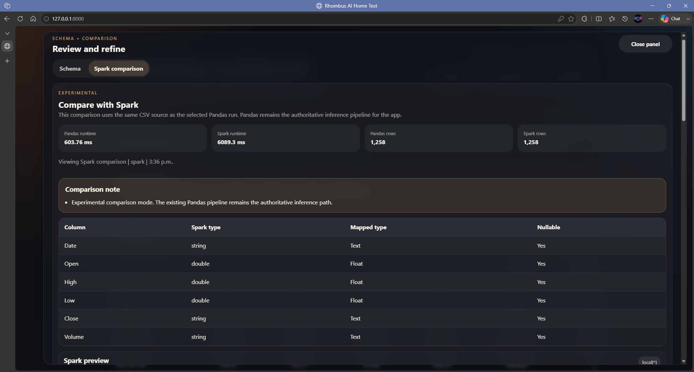

# Rhombus-AI-Home-Test

[](https://www.python.org/)
[](https://www.djangoproject.com/)
[](https://react.dev/)
[](https://www.typescriptlang.org/)
[](https://www.docker.com/)
[](https://rhombus-ai-home-test.onrender.com/)
[](LICENSE)
[](https://github.com/BrownAssassin/Rhombus-AI-Home-Test)
[](https://github.com/BrownAssassin/Rhombus-AI-Home-Test/commits/main)

Single-host Django + React workbench for browsing CSV and Excel files in Amazon S3, inferring Pandas data types, previewing processed data with override controls, and tracking async processing runs. The app also includes an experimental PySpark comparison mode for completed CSV runs.

Public deployment: `https://rhombus-ai-home-test.onrender.com/`

## Overview

The workbench is built around one primary workflow:

1. connect to an S3 bucket with runtime AWS credentials
2. browse supported CSV and Excel objects
3. process one file through the shared Pandas inference pipeline
4. inspect the processed preview and inferred schema
5. optionally override types and reprocess
6. optionally compare a completed CSV result against Spark

The frontend keeps the current processed preview stable while users browse files or wait for background work to finish, and the backend stores sanitized run metadata without persisting AWS secrets. That makes the app practical to operate as a small deployed product while still reading clearly as a portfolio-style showcase of async workflow design, inference UX, and backend architecture discipline.

## Screenshots

**Connection hero:** S3 connection setup with runtime credentials kept out of local storage.



**Workbench ready:** The workbench after browsing supported S3 files and selecting a dataset to process.



**Processed preview:** Processed preview with paginated results that stay visible while users browse other files or wait for background work.



**Schema overrides:** Schema review and manual override controls before reprocessing the selected dataset.



**Spark comparison:** Experimental Spark comparison for a completed CSV Pandas run, including runtime and schema mapping.



## Core capabilities

- Lists supported `.csv`, `.xls`, and `.xlsx` S3 objects for a bucket or prefix.
- Infers conservative data types for text, integers, floats, booleans, dates, datetimes, categories, and complex values.
- Validates manual type overrides before reprocessing.
- Pages through processed preview rows from the backend instead of locking the UI to a tiny in-memory sample.
- Prefers async processing through Redis and Celery, while falling back to synchronous inline processing when queue infrastructure is unavailable.
- Tracks recent processing and comparison runs so the workbench can reload completed results without reprocessing.
- Offers an experimental Spark comparison mode for completed CSV Pandas runs.

## Async and Spark behavior

- **Pandas is the authoritative processing engine.** All user-facing schema inference and override workflows are grounded in the Pandas pipeline.
- **Async processing is the default workbench path.** The frontend queues work through Celery when Redis is available and polls tracked run status updates.
- **Synchronous processing remains a safe fallback.** If queueing fails, the app processes the file inline and surfaces a non-blocking notice.
- **Spark is experimental and comparison-only.** It runs after a completed CSV Pandas result exists and does not replace the main inference pipeline.

## Inference and performance approach

- CSV files are staged from S3 to local disk before processing so larger files do not depend on one long-lived streaming request.
- Repeated CSV preview-page requests can reuse a small bounded staged-file cache to avoid re-downloading the same S3 object.
- Excel files are supported, but the selected sheet is still loaded into memory and capped at 20 MB in this MVP.
- Type inference is intentionally conservative so ambiguous dates, mixed text, and lossy coercions require explicit user overrides.
- Date and DateTime share pandas datetime storage internally, but the preview renders them differently so date-only fields stay calendar-shaped.

## Stack

- **Backend:** Django 5, Django REST Framework, Pandas, boto3, Celery, Redis, PySpark (experimental)
- **Frontend:** React 19, TypeScript, Vite, Vitest
- **Local orchestration:** Docker Compose for web, worker, and Redis
- **Deployment shape:** single host serving the built frontend from Django, with a separate Spark-capable worker target available for Compose or future multi-service deployments

## Project structure

- [`backend/`](backend): Django project, API, application layer, processing services, and CLI entrypoints
- [`backend/manage.py`](backend/manage.py): canonical Django management entrypoint
- [`backend/cli/`](backend/cli): local smoke-test CLI wrappers
- [`frontend/`](frontend): React + TypeScript workbench
- [`examples/`](examples): sample datasets for local smoke testing
- [`docker/`](docker): container startup helpers
- [`docs/brief/`](docs/brief): original project brief and supporting notes
- [`Dockerfile`](Dockerfile): lean web target plus Spark-capable worker target
- [`docker-compose.yml`](docker-compose.yml): local async stack with a shared SQLite volume

## Backend architecture

The backend is organized around explicit layers:

- **API layer:** DRF views validate serializers, call application-layer functions, and map stable errors to HTTP responses.
- **Application layer:** `backend/data_processing/application/` owns file browsing, sync processing, async queueing, preview paging, and run lookup orchestration.
- **Service layer:** `backend/data_processing/services/` contains inference, S3 access, staging, Spark comparison, observability, and run lifecycle mechanics.
- **Task layer:** Celery tasks are thin infrastructure wrappers that call typed application-layer entrypoints.
- **Run store:** `ProcessingRun` exposes query helpers for recent, active, and object-filtered access so the jobs tray can use lighter summary queries while detail paths still load the full payload.

## Requirements

- Python 3.12 recommended for local development
- Node.js 22 or newer
- npm 11 or newer
- Docker Desktop for container verification and the full async stack
- Java 17 or newer only if you want to run the experimental Spark comparison path outside Docker

If you only want the stable synchronous/Pandas path, Redis and Java are optional. Docker Compose remains the easiest way to exercise the full async and Spark setup together.

## Local setup

### 1. Create the backend environment

```powershell
py -3.12 -m venv .venv
.\.venv\Scripts\Activate.ps1
python -m pip install -r requirements.txt
```

### 2. Install frontend dependencies

```powershell
cd frontend
npm install
cd ..
```

### 3. Apply migrations

```powershell
python backend/manage.py migrate
```

### 4. Choose a local run mode

**Django serving the built frontend**

```powershell
cd frontend
npm run build
cd ..
python backend/manage.py runserver
```

Open `http://127.0.0.1:8000`.

**Split development mode**

```powershell
python backend/manage.py runserver
```

In a second terminal:

```powershell
cd frontend
npm run dev
```

Open `http://127.0.0.1:5173`.

**Full async stack via Docker Compose**

```powershell
docker compose up --build
```

This starts:

- `web`: Django + built frontend
- `worker`: Celery worker with Java + PySpark support
- `redis`: broker and result backend

The Compose stack shares the named volume `rhombus-ai-home-test_app_data` so the web and worker services read and update the same SQLite-backed run history.

## Docker and deployment shape

The Docker setup intentionally separates the public web runtime from the heavier worker runtime:

- **`web-runtime` target:** lean production image for Render or other single-service web deployment
- **`worker-runtime` target:** local/demo worker image that keeps Java and PySpark for experimental Spark comparisons

That split keeps the public web image substantially smaller while still preserving the full local async + Spark workflow.

## Environment variables

Supported backend/runtime configuration includes:

- `DJANGO_SECRET_KEY`
- `DJANGO_DEBUG`
- `DJANGO_ALLOWED_HOSTS`
- `DJANGO_CSRF_TRUSTED_ORIGINS`
- `DJANGO_SQLITE_PATH`
- `DJANGO_FRONTEND_BUILD_DIR`
- `DJANGO_LOG_LEVEL`
- `DATA_PROCESSING_LOG_LEVEL`
- `WEB_CONCURRENCY`
- `GUNICORN_THREADS`
- `GUNICORN_TIMEOUT`
- `CSV_CHUNK_SIZE`
- `STAGED_FILE_CACHE_MAX_ITEMS`
- `STAGED_FILE_CACHE_TTL_SECONDS`
- `REDIS_URL`
- `CELERY_BROKER_URL`
- `CELERY_RESULT_BACKEND`
- `CELERY_TASK_TIME_LIMIT`
- `CELERY_TASK_SOFT_TIME_LIMIT`
- `CELERY_TASK_ALWAYS_EAGER`
- `PORT`

See [`.env.example`](.env.example) for a practical local/container starting point.

## CLI usage

The local CLI exercises the same inference service as the web app:

```powershell
python backend/cli/infer_data_types.py examples/sample_data.csv --preview-rows 5
```

Optional Excel sheet selection:

```powershell
python backend/cli/infer_data_types.py path\to\workbook.xlsx --sheet-name Sheet1
```

## API surface

The public REST surface remains:

- `POST /api/s3/files`
- `POST /api/data/process`
- `POST /api/data/process-async`
- `GET /api/data/runs`
- `GET /api/data/runs/<id>`
- `POST /api/data/preview`
- `POST /api/data/spark-compare`
- `GET /api/health/`

The frontend uses:

- `GET /api/data/runs` for compact recent-run summaries
- `GET /api/data/runs/<id>` for detailed run polling and completed payloads
- `POST /api/data/preview` for result paging

## Testing

Backend:

```powershell
python backend/manage.py test
python backend/manage.py check
```

Frontend:

```powershell
cd frontend
npm test -- --run
npm run build
```

CLI smoke test:

```powershell
python backend/cli/infer_data_types.py examples/sample_data.csv --preview-rows 5
```

Full local stack:

```powershell
docker compose up --build
```

Health check:

```text
http://127.0.0.1:8000/api/health/
```

## Render deployment

Render remains the recommended public host for this repository's single-host deployment shape.

For a standard web deployment:

1. create a Render Web Service
2. point it at this repository's `main` branch
3. choose `Docker` as the runtime
4. use `/api/health/` as the health check path
5. deploy the default lean web target from [`Dockerfile`](Dockerfile)

Recommended Render settings include:

- `DJANGO_SECRET_KEY`
- `DJANGO_DEBUG=False`
- optional `DJANGO_SQLITE_PATH=/app/data/db.sqlite3` if you later attach persistent storage
- `WEB_CONCURRENCY=1`
- `GUNICORN_THREADS=1`
- `GUNICORN_TIMEOUT=180`
- optional `DJANGO_LOG_LEVEL=INFO`
- optional `DATA_PROCESSING_LOG_LEVEL=INFO`
- tuned CSV/staging cache environment variables if needed for larger demos

Render automatically injects `PORT`, `RENDER_EXTERNAL_HOSTNAME`, and `RENDER_EXTERNAL_URL`, and the app folds those into Django's trusted runtime configuration.

## Notes and limitations

- AWS credentials are accepted at runtime and intentionally not stored in the database.
- CSV previewing is optimized around staged local files and bounded reuse; Excel previewing remains a memory-loaded path.
- Ambiguous dates and mixed columns intentionally stay conservative unless overridden.
- The app does not export a full transformed dataset in this MVP.
- A deployment that keeps SQLite in the container filesystem is fine for demos, but tracked run history resets when the service is rebuilt or restarted unless you attach persistent storage.
- Spark comparison is experimental, CSV-only, and intentionally framed as a side-by-side learning tool rather than a replacement for the Pandas pipeline.
